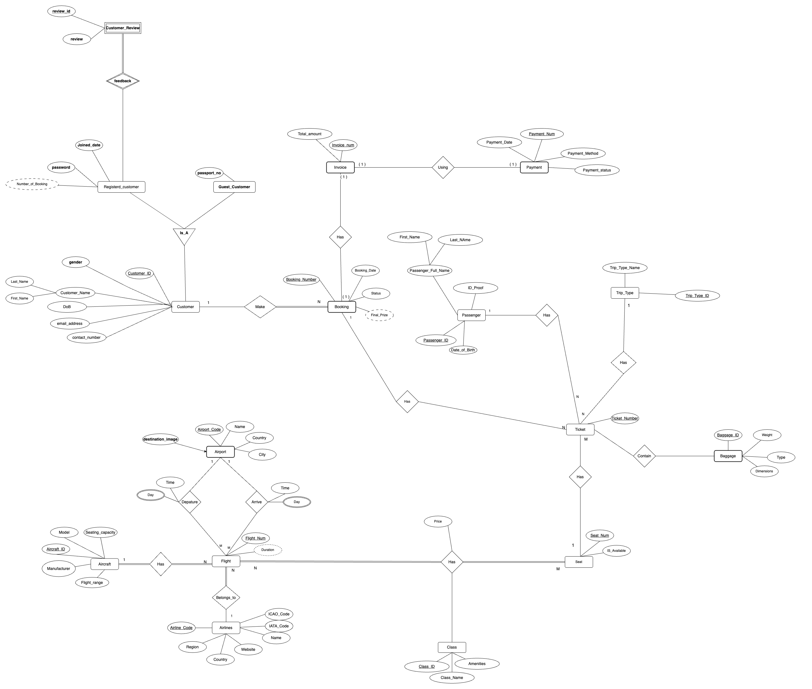

# AirTicket_DB_Project

## Project Description:

The goal of this project is to design and implement a comprehensive and efficient Airline Booking Database System. This system will manage all aspects of airline operations related to customer bookings, flights, tickets, payments, aircraft, and associated entities. The database will serve as the backbone for an airline or travel agency’s booking process, ensuring smooth transactions, efficient data management, and seamless user experience.

### ER diagram
